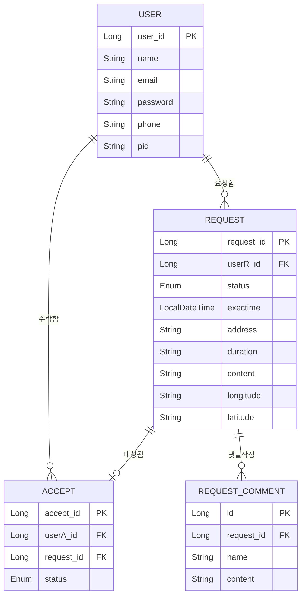

# 세모봉 (Semo-bong) - 세상의 모든 봉사
> **누구나 쉽게 도움을 주고받는 자원봉사 매칭 플랫폼**

---

## 프로젝트 개요
세모봉은 도움을 필요로 하는 사람과 도움을 주고자 하는 자원봉사자를 효율적으로 연결해주는 자원봉사 매칭 백엔드 시스템입니다. 단순한 게시판 형태를 넘어, 위치 기반 검색, 상태 기반 워크플로우 및 자동 알림 시스템을 갖추어 실제 서비스 운영 환경을 고려하여 설계되었습니다.

## 핵심 백엔드 역량 (Core Skills)
본 프로젝트는 다음과 같은 백엔드 개발자의 핵심 역량을 실무 수준으로 구현하는 데 집중했습니다.

### 1. 객체지향 설계 및 도메인 모델링
*   JPA 연관관계 매핑: User, Request, Accept, Comment 간의 복잡한 1:N, N:1, 1:1 관계를 지연 로딩(Lazy Loading) 및 연관관계 편의 메서드를 통해 최적화하여 설계했습니다.
*   도메인 주도 설계(DDD): 비즈니스 로직을 서비스 레이어에만 가두지 않고 도메인 엔티티 내에 응집시켜 객체지향적인 설계를 유지했습니다.

### 2. 상태 관리 기반의 워크플로우 (State Machine)
*   봉사 활동의 전 과정을 REGISTER -> ACCEPT -> MAILED -> RUNNING -> COMPLETE/EMERGENCY 등 세밀한 상태로 구분하여 관리합니다.
*   자동 상태 전이: 현재 시간과 봉사 예정 시간을 비교하여 자동으로 상태를 변경하는 백그라운드 로직(AsyncService)을 구현했습니다.

### 3. 위치 기반 검색 및 외부 API 활용
*   유클리드 거리 계산 알고리즘: 위도/경도 데이터를 활용하여 사용자 인근의 봉사 요청을 검색하는 커스텀 로직을 구현했습니다.
*   Kakao Map API 연동: 서버의 위치 데이터를 프론트엔드로 전달하여 지도상에 시각화하는 Full-Stack 연동을 경험했습니다.

### 4. 자동화된 통지 및 안전 시스템
*   Spring Java Mail: 봉사 전날 리마인더 및 종료 후 리뷰 요청 메일을 자동으로 발송합니다.
*   긴급 신고 시스템(Emergency Protocol): 봉사 중 발생할 수 있는 사고에 대비해 실시간 신고 및 관리자 통지 로직을 구축했습니다.

### 5. 안정성 확보 및 성능 모니터링
*   QueryDSL 활용: 복잡한 동적 쿼리를 타입 안정성을 보장하며 작성하여 런타임 에러를 최소화했습니다.
*   AOP 기반 성능 측정: Aspect를 활용하여 모든 서비스 로직의 실행 시간을 추적하고 병목 지점을 모니터링할 수 있는 인프라를 구축했습니다.
*   통합 테스트(Integration Test): 전체 비즈니스 시나리오를 검증하는 통합 테스트 코드를 통해 코드의 신뢰성을 확보했습니다.

---

## Database ER Diagram
시스템의 핵심 도메인 모델과 테이블 간의 관계를 시각화한 ERD입니다. Mermaid.js를 사용하여 표현했습니다.

---

## Tech Stack
| Category | Technology |
| --- | --- |
| Language | Java 17 |
| Framework | Spring Boot 2.7.5 |
| Data Access | Spring Data JPA, QueryDSL |
| Database | H2 Database (Embedded) |
| Security | Spring Security |
| View | Thymeleaf, Bootstrap, Kakao Map API |
| Tools | Gradle, Lombok, P6Spy (SQL logging) |

---

## 주요 기능 상세

### 위치 기반 봉사 검색
- 사용자 현재 위치를 기반으로 일정 거리 이내의 봉사 요청을 우선 노출
- 위도/경도 연산을 통한 거리 정렬 알고리즘 적용

### 라이프사이클 관리 (AsyncService)
- Remind Mail: 봉사 시작 24시간 전 자동 안내
- Status Update: 시간 경과에 따른 상태 자동 변경 (Accept -> Running -> Complete)
- Automatic Cancellation: 봉사자가 나타나지 않은 마감된 요청 자동 취소

### 세이프티 가드 (Safety Guard)
- 봉사 진행 중(RUNNING) 상태에서만 활성화되는 긴급 버튼
- 긴급 상황 발생 시 관리자에게 즉시 상세 정보(위치, 연락처) 메일 발송

---

## 테스트 전략
- JUnit 5 활용: 단위 테스트 및 통합 테스트 수행
- Full-Logic Test: 회원 가입부터 봉사 요청, 수락, 상태 전이, 리뷰 등록까지의 전체 시나리오를 검증하여 비즈니스 로직의 무결성 증명 (IntegralTest.java)

---

## 개발 소감 및 인사이트
- 백엔드 개발의 책임감: 긴급 상황 처리나 자동 메일 발송 로직을 구현하며, 시스템의 안정성이 사용자 안전과 직결될 수 있음을 배웠습니다.
- 데이터 중심 설계의 중요성: JPA를 통해 객체와 DB를 매핑하며, 효율적인 테이블 설계가 비즈니스 요구사항을 얼마나 유연하게 해결할 수 있는지 체감했습니다.
- 클린 코드와 AOP: 비즈니스 로직과 공통 관심사(성능 측정 등)를 분리함으로써 코드의 가독성과 유지보수성을 높이는 경험을 했습니다.
